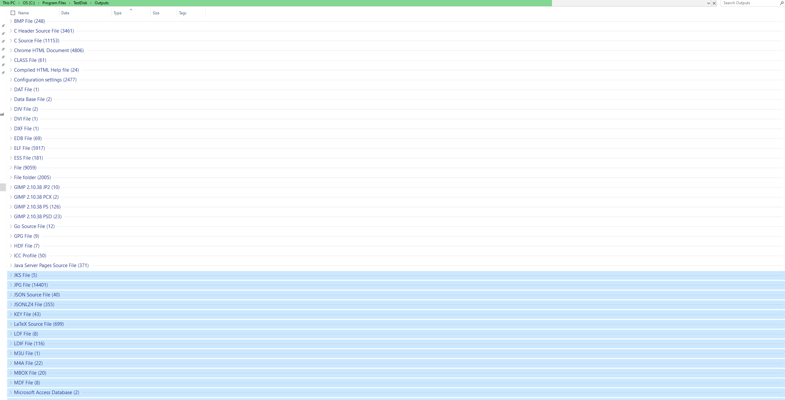

# Data-Retrieval-Forensics

This project demonstrates forensic-level file recovery using **TestDisk** and **PhotoRec**.  
The simulation replicates a scenario where a disk has been partially formatted or corrupted, and recovery of various file types (JPG, PDF, DOCX, SQL, MBOX, etc.) is required.

---

## 📁 Project Structure

Data-Retrieval-Forensics/ 
├── README.md 
├── dataretrieval.png 
├── TestDisk_Recovery_Report.md (optional) 
├── /Recovered_Files/ 
│   ├── JPG/ 
│   ├── DOCX/ 
│   ├── JSON/ 
│   ├── SQL/ 
│   └── Misc/ 

---

## 🔧 Tools Used

- **TestDisk / PhotoRec** – for raw file carving from disk/volume
- **FTK Imager** – for previewing partition structure and deleted files
- **Autopsy (optional)** – for post-recovery indexing and filtering
- **Windows 10 VM / Kali Linux** – test environment for data loss and recovery

---

## 🧪 Recovery Process Overview

1. **Simulated Drive Corruption**:
   - Deleted key files and emptied recycle bin
   - Wiped partition headers and formatted (Quick NTFS)

2. **Carving with PhotoRec**:
   - Targeted recovery of:
     - `JPG`, `DOCX`, `SQL`, `MBOX`, `JSON`, and `KEY` file types
   - Scan took approx. 30–45 minutes on 100+ GB volume

3. **Sorting Output**:
   - Files grouped and validated by extension
   - Recovered data volume exceeded 15K files

4. **Key Result**:
   - Successfully recovered credentials, source code, and structured database fragments from damaged partition

---

## 📸 Sample Screenshot

---

## ⚠️ Disclaimer

This project is for educational and forensic lab simulation purposes only.  
Always test data recovery on virtual environments or disk images — never on live production systems.

---
